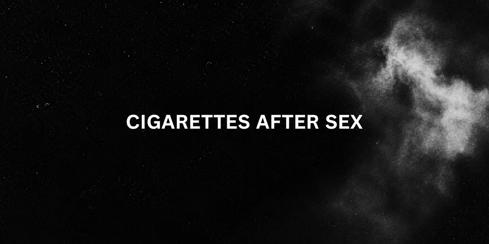

<div align="center">



<br>
<br>


<br>

### Um estudo visual e estrutural sobre minimalismo digital, dream pop e arquitetura front-end em HTML, CSS e JavaScript puro.

<br>


</div>

---

# ── 🌑 Sobre o Projeto ──

Este projeto foi desenvolvido como um site informativo e visualmente atmosférico dedicado à banda **Cigarettes After Sex**, utilizando exclusivamente tecnologias fundamentais da web:

- HTML5
- CSS3
- JavaScript puro (Vanilla JS)

A proposta central foi construir uma experiência digital cinematográfica inspirada na estética noir, no movimento slowcore/dream pop e na identidade minimalista da banda.

Ao invés de utilizar frameworks prontos, toda a estrutura foi escrita manualmente, priorizando:

- organização semântica;
- responsividade;
- acessibilidade visual;
- leveza de renderização;
- consistência tipográfica;
- composição monocromática;
- controle refinado de layout e estados visuais.

O resultado é um ambiente digital silencioso, escuro e contemplativo.  
Cada seção foi projetada para funcionar como extensão visual da atmosfera sonora de *Cry*, *Apocalypse*, *K.* e *X’s*.

---

# ── 💨 Estrutura do Repositório ──

```bash
abv11/
│
├── img/
│   ├── logocaswhite.png
│   ├── Capa de Cry.jpg
│   ├── Capa de X_s.jpg
│   ├── spotify.png
│   └── ...
│
├── index.html
├── sobre.html
├── discografia.html
├── contato.html
│
├── styles.css
├── script.js
│
└── README.md
```

# ── 🎬 Arquitetura das Páginas ──

## `index.html`

Página inicial responsável pela introdução visual do projeto.

Contém:

* Hero Section centralizada;
* logotipo em destaque;
* navegação responsiva;
* cartões informativos;
* apresentação do álbum *X’s*;
* footer institucional.

A estrutura foi desenvolvida para causar impacto visual imediato sem excesso de elementos gráficos.

---

## `sobre.html`

Página voltada à contextualização histórica da banda.

Inclui:

* origem do grupo;
* trajetória artística;
* gêneros musicais;
* membros atuais;
* gravadora;
* identidade sonora.

A diagramação utiliza grids flexíveis e tipografia espaçada para favorecer leitura longa.

---

## `discografia.html`

Página dedicada à discografia completa da banda.

Apresenta:

* álbuns de estúdio;
* EPs;
* singles;
* cronologia musical;
* capas organizadas em grid responsivo.

A organização visual foi pensada como um arquivo digital de memória musical em baixa luminosidade.

---

## `contato.html`

Central de plataformas oficiais e streaming.

Integra:

* Spotify;
* Apple Music;
* Bandcamp;
* YouTube;
* SoundCloud;
* Instagram;
* TikTok;
* Facebook;
* X/Twitter.

Os cards utilizam microinterações suaves para reforçar sensação de fluidez e continuidade visual.

---

# ── 🪐 Design & Direção Visual ──

O projeto foi inteiramente baseado em uma identidade monocromática.

## Principais decisões visuais:

* predominância de preto fosco;
* contrastes em branco suave;
* bordas minimalistas;
* tipografia leve;
* grids amplos;
* animações discretas;
* ausência de poluição visual.

A folha `styles.css` centraliza toda a identidade visual através do uso de variáveis CSS:

```css
:root {
    --primary-color: #000000;
    --secondary-color: #2d2d2d;
    --accent-color: #3a3a3a;
    --light-bg: #1f1f1f;
    --border-color: #4a4a4a;
    --text-muted: #b0b0b0;
}
```

A escolha por transições suaves (`transition: all 0.3s ease`) foi utilizada para evitar movimentos bruscos e preservar a atmosfera contemplativa da interface.

---

# ── ⚙️ JavaScript & Interatividade ──

O sistema interativo foi desenvolvido em JavaScript puro.

Funcionalidades implementadas:

* menu hamburger responsivo;
* abertura e fechamento dinâmico;
* fechamento automático ao clicar fora;
* smooth scroll;
* destaque automático da página ativa na navbar.

Trecho estrutural:

```javascript
hamburger.addEventListener('click', function () {
    hamburger.classList.toggle('active');
    navMenu.classList.toggle('active');
});
```

A ausência de bibliotecas externas permitiu maior controle sobre desempenho, carregamento e comportamento da aplicação.

---

# ── 📱 Responsividade ──

O projeto foi adaptado para:

* desktops;
* notebooks;
* tablets;
* smartphones.

Foram utilizados:

* media queries;
* grids responsivos;
* flexbox;
* redimensionamento proporcional de imagens;
* reorganização dinâmica de componentes.

Exemplo:

```css
@media (max-width: 768px) {

    .album-content {
        grid-template-columns: 1fr;
    }

    .contact-grid {
        grid-template-columns: 1fr;
    }
}
```

---

# ── 🌑 Filosofia Técnica ──

Este projeto não busca excesso.

Ele trabalha com contenção.

Sem frameworks pesados.
Sem interfaces saturadas.
Sem animações agressivas.

A proposta foi construir uma experiência silenciosa utilizando apenas base sólida de front-end.

Cada linha foi escrita manualmente.

Cada seção foi organizada pensando simultaneamente em:

* performance;
* legibilidade;
* composição visual;
* identidade artística;
* experiência emocional.

---

# ── 💿 Referências Estéticas ──

O desenvolvimento visual foi inspirado em:

* cinema noir;
* fotografia analógica;
* slowcore;
* dream pop;
* interfaces minimalistas;
* capas monocromáticas;
* tipografia editorial moderna.

Principais influências:

* Cigarettes After Sex
* Joy Division
* Wong Kar-wai
* estética VHS
* interfaces editoriais contemporâneas

---

# ── 🖋️ Dezembro de 2024 ──

> “Stay with me, I don't want you to leave...”

Existe uma diferença entre programar uma interface e registrar um instante.

Este projeto nasceu exatamente dessa diferença.

O preto absoluto do fundo.
As transições lentas.
O silêncio visual entre os elementos.
A escolha por Vanilla JS.
As bordas discretas.
O contraste branco sobre cinza escuro.

Nada aqui foi acidental.

A interface inteira foi construída como memória renderizada em tempo real.

Como uma madrugada tentando permanecer aberta em outra aba do navegador.

---

# ── 📚 Competências Aplicadas ──

Durante o desenvolvimento foram aplicados conhecimentos de:

* HTML semântico;
* arquitetura de navegação;
* CSS responsivo;
* variáveis CSS;
* Flexbox;
* CSS Grid;
* animações;
* JavaScript DOM;
* manipulação de classes;
* responsividade mobile;
* organização de assets;
* estruturação de repositório;
* experiência do usuário;
* design visual minimalista.

---

# ── 💨 Autor ──

**Angélica Benigno de Vasconcelos**
Técnico Integrado em Informática para Internet • IFPE

Projeto desenvolvido como estudo visual, estrutural e atmosférico sobre front-end minimalista e identidade sonora digital.

---

<div align="center">

### ── 🌑 Cigarettes After Sex ──

*"Nothing's gonna hurt you baby..."*

</div>

